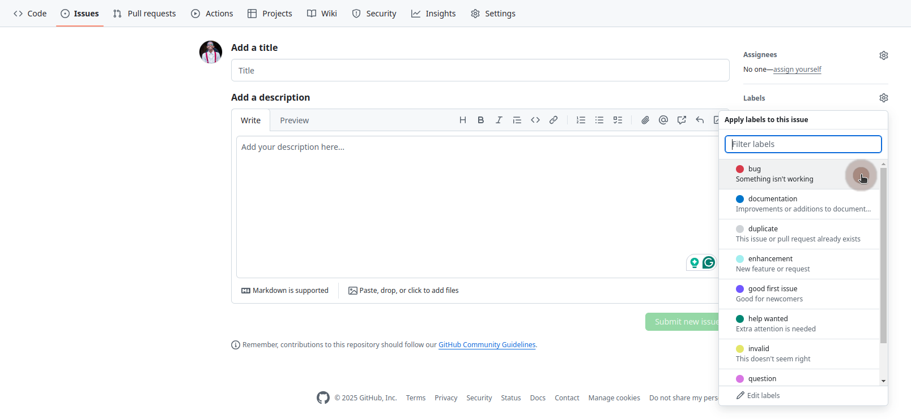
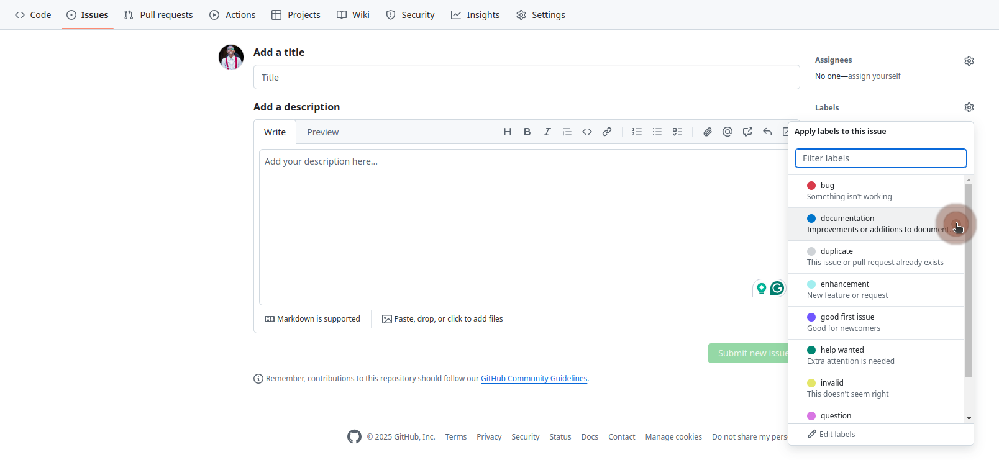
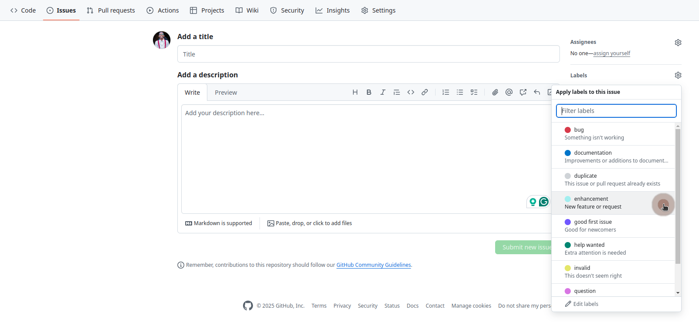
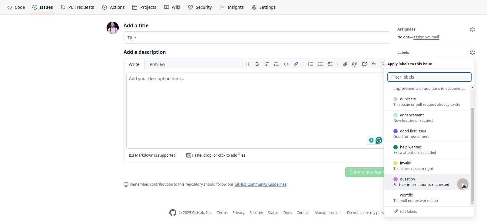

# React Starter Kit

A template repository for creating a react app with Vite and using SCSS for styles.

## Description

This app is meant to cut the manual work in the development of React projects, by creating reusable essentials that are uniform in most projects. Some of these essentials are:

- Elements & resources in `index.html`.
- Components in `components` folder.
- Project icon/logo in `assets` and `public` directories.
- Packages in `package.json`.
- Documentation structure in `README.md`.
- Routing configuration in `main.tsx` and `App.tsx`.

## Structure

Navigate through the project in the following structure:

```
.
├── react-starter/
│   ├── public/
│   ├── src/
│   │   ├── assets/
│   │   ├── components/
│   │   └── ...
│   ├── ...
│   │
│   ├── README.md
│   └── ...
├── LICENSE
└── README.md
```

- The `public` directory contains production-ready resources that the application can access upon deployment.
- The `src` directory contains the project's source code, including components and styles, among other files.
  - The `assets` subdirectory contains static resources like images and icons.
  - The `components` subdirectory contains reusable components that can be shared across the application.

### 1. Necessary Updates

This app creates a foundation from which you can build the rest of your application. Feel free to open the following files/directories and edit/update them to align with your project.

- `./index.html`
- `./public/`
- `./src/assets/`
- `./src/components/`
- `./src/components/Home.tsx`
- `./src/App.tsx`
- `./src/main.tsx`
- `./README.md`
- `../README.md`

Be sure to check out the contents of the `./package.json` file.

- If you want to retain all the installed dependencies in this file, you may leave it as it is.
- If you want to remove a particular dependency from the project, highlight that dependency and delete it (along with the comma at the end of the line).

### 2. Optional Updates

This app sets a foundation for the creation and use of:

- Services in `./src/services/`.
- Forms in `./src/forms/`.
- Utils in `./src/utils/`.

#### 2.A. NOTE (on `services`):

- If your project will require services, you can use the `services` directory in `./src/`.
- If your project **does not** require services, you can delete the `services` directory in `./src/`.

#### 2.B. NOTE (on `forms`):

- If your project will require forms, you can use the `forms` directory in `./src/`.
- If your project **does not** require forms, you can delete the `forms` directory in `./src/`.

#### 2.C. NOTE (on `utils`):

- If your project will require utilities (utils), you can use the `utils` directory in `./src/`.
- If your project **does not** require utilities (utils), you can delete the `utils` directory in `./src/`.

## Setup

Follow the steps below to get the project ready for local development.

### 1. Clone the Repo

Clone this project's repository by running the following command:

```
git clone https://github.com/benie254/react-starter-kit.git
```

### 2. Open the Project

Open the project in a **code editor** of your choice. If you use VSCode, run the following command:

```
code .
```

### 3. Navigate to Project Dir

Navigate to the project directory by running the following command:

```
cd react-starter
```

### 4. Install Dependencies - Packages & Libs

Install package/library dependencies by running the following command:

```
npm install
```

or

```
yarn install
```

### 5. Start Development Server

Start the development server by running the following command:

```
npm run dev
```

## Technologies Used

- React (v18.3.1)
- TypeScript (v5.6.2)
- SASS (v1.83.1)
- HTML/JSX

## Issues

Issues on GitHub repos are classified as (among more):

- Bugs
- Documentation
- Enhancements
- Questions

To raise an issue, go to this GitHub repository's **issues** tab:

- [https://github.com/benie254/react-starter-kit/issues/new](https://github.com/benie254/react-starter-kit/issues/new)
```
https://github.com/benie254/react-starter-kit/issues/new
```

### 1. Bugs

Currently, there are no known bugs. If you encounter any, please raise an issue labeled as `bug`.



### 2. Documentation

Got any suggested improvements or additions to this project's documentation? Please raise an issue labeled as `documentation`.



### 3. Enhancements

Got a new feature/enhancement in mind? Please raise an issue labeled as `enhancement`.



### 4. Questions

Got any questions? Please raise an issue labeled as `question`.



## Contact Details

Reach out via email to discuss this or more projects:
- [fullstack.benie@gmail.com](mailto:fullstack.benie@gmail.com)
```
fullstack.benie@gmail.com
```

# License

MIT License

Copyright (c) 2025 Benson Langat

Permission is hereby granted, free of charge, to any person obtaining a copy
of this software and associated documentation files (the "Software"), to deal
in the Software without restriction, including without limitation the rights
to use, copy, modify, merge, publish, distribute, sublicense, and/or sell
copies of the Software, and to permit persons to whom the Software is
furnished to do so, subject to the following conditions:

The above copyright notice and this permission notice shall be included in all
copies or substantial portions of the Software.

THE SOFTWARE IS PROVIDED "AS IS", WITHOUT WARRANTY OF ANY KIND, EXPRESS OR
IMPLIED, INCLUDING BUT NOT LIMITED TO THE WARRANTIES OF MERCHANTABILITY,
FITNESS FOR A PARTICULAR PURPOSE AND NONINFRINGEMENT. IN NO EVENT SHALL THE
AUTHORS OR COPYRIGHT HOLDERS BE LIABLE FOR ANY CLAIM, DAMAGES OR OTHER
LIABILITY, WHETHER IN AN ACTION OF CONTRACT, TORT OR OTHERWISE, ARISING FROM,
OUT OF OR IN CONNECTION WITH THE SOFTWARE OR THE USE OR OTHER DEALINGS IN THE
SOFTWARE.
